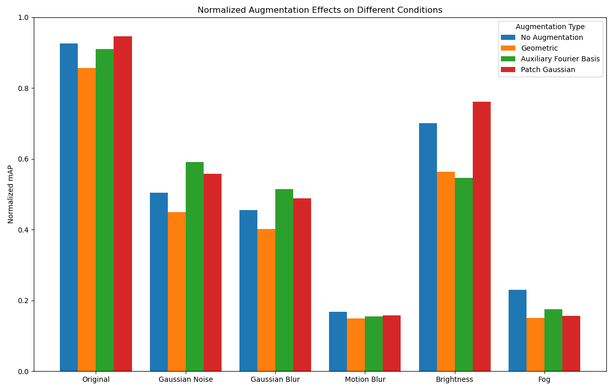

# airbus-ship-detection
Code for the Airbus Ship Detection on Kaggle, modified for the Machine Learning for Vision and Multimedia class at Politecnico di Torino, with a focus on Data Augmentation Techniques. A brief presentation of our work can be found [here](presentation.pdf).
We wanted to train a model to be more resistant to unforeseen noise, utilizing lesser known data augmentation techniques, and then test it on on disturbances that might happen in a real world environment. More details on the [paper](/paper.pdf).



## Folders

- `models`: contains a `model.tar` for each model, describing the model weights, the learning rates for each iteration, the losses, and much more. Those informations are later used to test the model, and produce the plots
- `media` contains a `result.png` image for each model comparing the training losses with the validation losses

## Training targets

The target (ground-truths) are a list of dictionaries, containing these three fields

``` python
"boxes": tensor([], dtype=torch.float64),
"label": tensor([], dtype=torch.int64),
"image_id": str
```